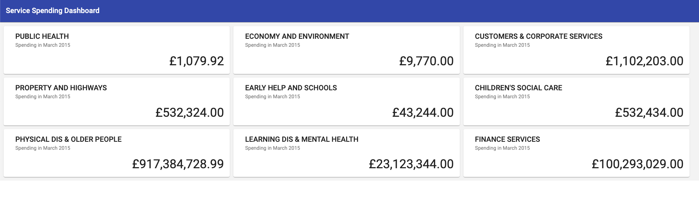

### Panaseer Engineering: Fullstack Take Home Coding Exercise 🖥️

👋 Welcome to our take-home coding project! This is a chance for you to show us how you think through solutions, approach technical designs and adapt to an existing codebase. Remember you really **shouldn't spend more than 4 hours** on this exercise, otherwise you risk over-cooking it.

⏰ If you run out of time to complete all the tasks, don't worry! Rather than coding until the last minute set yourself an end time and use 30 minutes at the end to reflect how you can tell us about your experience and how you approached the work. If you didn't get through all the scenarios perhaps think about how you would've approached the next one and tell us about it. If you did get through all of them then tell us what you would do next with more time.

🚀 With that out of the way, let's get started...

---

### The Application
For the coding exercise we are building on an application that has an existing frontend and api. Your tasks will focus on finishing and extending specific aspects of the project.

### The Data

The dataset used by the application holds spending/expenses data for a single UK council.
The spending in this data set is categorised by `service`, which are departments within the council eg. `PUBLIC HEALTH`.

This data is loaded into the `Spending` table with the model representation in the `Spending` class.

This raw data is then aggregated to give the total spending per service.

### Our User
Our main user is the Council Accountant for Rochdale Borough. One of their responsibilities is monitoring the total spending of the different services. To support our user in that task, we've started creating a dashboarding application that shows the total spending by each service.

---
## Application Structure
### The Frontend
There are 2 different directories for the FE, one is written in React and the other in Angular. If your task involves modifying the front-end, please use one and ignore the other. So far the implementation includes the dashboard UI components to visualise spending for each council service.

Instructions on running the frontend are available in the Readme file in either of the FE directories. After starting up the FE, you should see a dashboard similar to the one in the screenshot below. This is what we will be building on in this exercise.

### The API
The API is based on Java, Gradle and Spring Boot. The current implementation loads the spending data from a sql script into an in-memory H2 database on application startup. The spending data can be accessed using the `SpendingRepository`.

Instructions on running the API are available in the [Readme](api/README.md) file of the [api](api) directory.

The API supports Java version 8+.